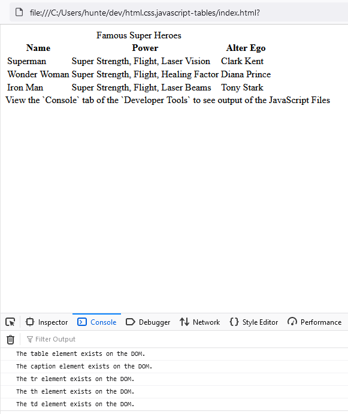

# HTML Table Elements

* **Purpose** - To gain familiarity with HTML Table Elements

## Objective
* For this assignment, learners should create an HTML file with a table element that includes a caption element and several rows and cells. The table should contain the following data:

| Name         | Power                                  | Alter Ego    |
|--------------|----------------------------------------|--------------|
| Superman     | Super Strength, Flight, Laser Vision   | Clark Kent   |
| Wonder Woman | Super Strength, Flight, Healing Factor | Diana Prince |
| Iron Man     | Super Strength, Flight, Laser Beams    | Tony Stark   |

* In addition to the table, learners should also create a form element that includes a text input, a select dropdown, and a submit button.
  * The form should be set up to submit the data to a server, but the actual submission does not need to be implemented.
* The learners should use the `table`, `caption`, `tr`, `th`, and `td` tags to create the table and form elements, and use appropriate attributes to style and organize the elements as needed.

### Solution View

## How to Download

#### Part 1 - Forking the Project
* To _fork_ the project, click the `Fork` button located at the top right of the project.

#### Part 2 - Navigating to _forked_ Repository
* Navigate to your github profile to find the _newly forked repository_.
* Copy the URL of the project to the clipboard.

#### Part 3 - Cloning _forked_ repository
* Clone the repository from **your account** into the `~/dev` directory.
  * if you do not have a `~/dev` directory, make one by executing the following command:
    * `mkdir ~/dev`
  * navigate to the `~/dev` directory by executing the following command:
    * `cd ~/dev`
  * clone the project by executing the following command:
    * `git clone https://github.com/MYUSERNAME/NAMEOFPROJECT`

#### Part 4 - Check Build
* Ensure that the tests run upon opening the project.
    * You should see `Tests Failed: 99 of 99 tests`

## How to Submit

#### Part 1 -  _Pushing_ local changes to remote repository
* from a _terminal_ navigate to the root directory of the _cloned_ project.
* from the root directory of the project, execute the following commands:
    * add all changes
      * `git add .`
    * commit changes to be pushed
      * `git commit -m 'I have added changes'`
    * push changes to your repository
      * `git push -u origin master`

#### Part 2 - Submitting assignment
* from the browser, navigate to the _forked_ project from **your** github account.
* click the `Pull Requests` tab.
* select `New Pull Request`
